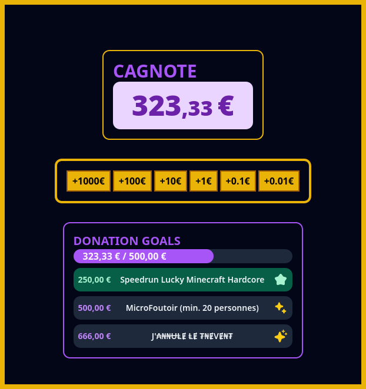

# TNEvent Widgets

OBS Studio / Streamlabs widgets for the caricative event, TNEvent, organized by TELECOM Nancy.

## How does it look?

## Build

These widgets are built with Svelte 5 (Preview version). The only thing you need to run this project is `npm` (or similar, like `pnpm`).

**Install the deps**:

``npm install``

or 

``pnpm install``

**Run the app (for development):**

``npm run dev``

or 

``pnpm dev``

**Enjoy!**

## License

This project is NOT under any license. Thus, you cannot reuse this project for your personal uses (nor commercial ones). Per GitHub TOS, your only right is to fork this repository on your GitHub account.
